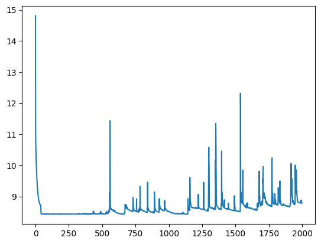

Fabian 1030-5pm
# Primer data Loader system
comenzando con
$$
P_{k} = \frac{d}{dt}X_{k} 
$$

Se organizarón los datos de manera que cada i-dato es:
$$
\{ \{ X_k, X_{k+1}, X_{k+2} \}, \{  P_k, P_{k+1}, P_{k+2}  \} \}
$$


# Primer entrenamiento del modelo
Se creo el modelo basico 
Se configuró para que el sistema fuese una red residual;
con multiples outputs, de manera que aprende a predecir el siguiente punto de igual forma

un bloque recurrente funciona tal que:
$$
X_{k+1} = RB(X_k)
$$

Mientras que internamente el modelo trabaja con multiples bloques recurrente y guarda la output
$$
Mo(X_k) = 3 \times RB(X_k) \Rightarrow \{ X_{k+1}, X_{k+2}, P_k \}
$$

Este modelo se entrenó por 2000 epocas pero tras las primeras 10 acabó en un minimo global, demostrando falta de información suficiente para continuar la inferencia



# Hipotesis del Problema 1:
Otra cantidad necesaria es la velocidad en un instante, el cambio instantaneo de posición principalemente se verá afectado por la primera derivada más que por lo que dicte su propio modelo.

Otra cosa es que el modelo no es generalizable pues aún no se encuentra la función de perdida que tiene en cuenta la 2da derivada

Por tanto se propone una modificación para tener en cuenta la 2da derivada:


por tanto ahora la input es:
```python
xk_train = train_dataset[0][:, :, 0]
dxk_dt_train = train_dataset[1][:, :,0]

xkp1_train = train_dataset[0][:, :,1]
xkp2_train = train_dataset[0][:, :,2]
dxdt_train = train_dataset[1][:, :,1]

Z_train =tf.stack([xk_train, dxk_dt_train], axis=-1)
Z.shape
```